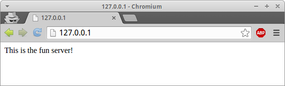

Dockerized Multi-Flask Server With Nginx
========================================

What is this?
-------------
This is a sample Docker configuration that puts two `gunicorn`ed Flask servers
behind nginx on one machine.

So if you have multiple websites that don't have a lot of visitors, you could
put them on one server, and provision everything with Docker.

Going from a blank VPS to having a fully-functioning server is 5 steps.  One of
them is a `cd`.


What to Do?
-----------

  1. [Install docker](http://docs.docker.com/installation/ubuntulinux/)
  2. [Install docker-compose](http://docs.docker.com/compose/install/)
  3. `$ git clone git@github.com:sergeio/docker_multiflask_server.git`
  4. `$ cd docker_multiflask_server`
  5. `$ docker-compose up -d`

The last step might take a while the first time, as docker has to download
everything.

Now What?
---------

Now you have two flask servers running in docker containers, and a linked nginx
container.  You can see them here:

```bash
$ docker-compose ps
              Name                            Command               State              Ports
-------------------------------------------------------------------------------------------------------
dockermultiflaskserver_fun_1       /bin/sh -c ./server start_ ...   Up      8002/tcp
dockermultiflaskserver_nginx_1     /bin/sh -c nginx                 Up      443/tcp, 0.0.0.0:80->80/tcp
dockermultiflaskserver_serious_1   /bin/sh -c ./server start_ ...   Up      8001/tcp
```

Now, when you go to 127.0.0.1, nginx will redirect you to the fun server:



If we go to the fun server's /bingo page, we can pretend to play bingo!


And when you go to 0.0.0.0, nginx redirects you to the serious server:


Serious bingo is less fun.


